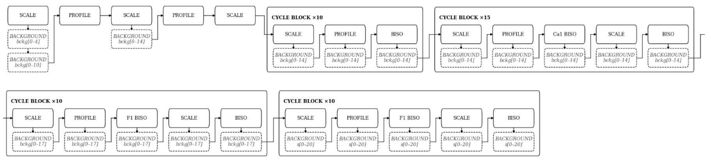
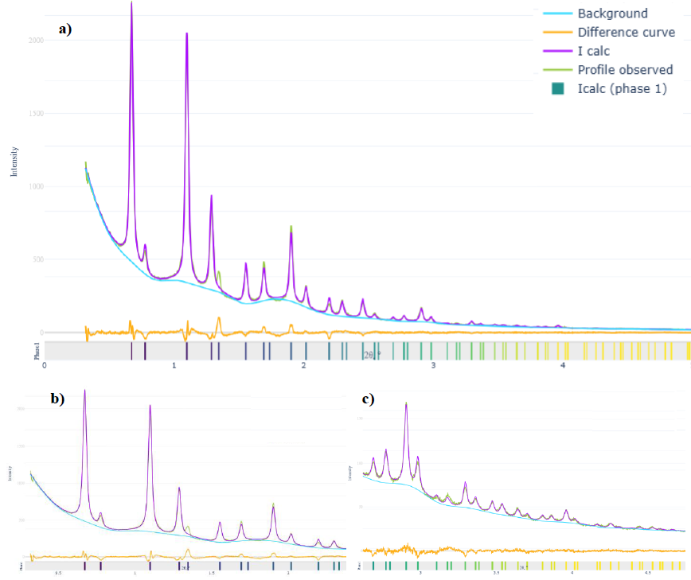

# Rietveld-based Electron Diffraction Refinement (RED)

## 📌 Overview

This project implements a Python-based pipeline for **sequential refinement of diffraction data parameters** using a Rietveld-like approach.

> **RED (Rietveld ED)** — Rietveld Electron Diffraction method.

The goal of the project is to:
- reconstruct diffraction profiles
- iteratively refine model parameters
- improve agreement between experimental and calculated data

---

## Key Features

- Iterative parameter refinement (scale, background, profile, temperature factors)
- Custom fitting workflow implementation
- Background modeling using:
  - Legendre polynomials  
  - spline approximation
- Peak profile modeling (Pseudo-Voigt function)
- Local calibration of angular scale (2θ correction)
- Correlation-based alignment of experimental and simulated data
- Analysis of model stability and parameter sensitivity

---

## Method Overview

The refinement procedure consists of several stages:

1. Initialization of the diffraction model  
2. Sequential optimization of:
   - scale factor  
   - background parameters  
   - peak profile parameters  
3. Cyclic refinement with increasing model complexity  
4. Calibration of angular scale (2θ correction via correlation analysis)  
5. Final refinement including:
   - atomic thermal parameters  
   - electronic structure parameters  

See the workflow diagrams below.

---

## Workflow

### Refinement pipeline

The diagram illustrates the sequential refinement procedure, including:
- global parameter optimization
- cyclic refinement blocks
- gradual increase of model complexity

---

## Results

### Final model vs experimental data

- Final agreement factor: **Rp ≈ 2.7%**
- Significant improvement after angular scale calibration
- Stable convergence of the refinement procedure
- Systematic deviations corrected after calibration

---

## Project Status

⚠️ This project is currently under development.

Some parts of the pipeline are not fully implemented yet
Code structure is being actively refined

Jupyter notebooks contain the current working implementation

---

## Notes

This project is based on research work and is being gradually transformed into a structured software solution.

The current implementation represents a working prototype of the refinement pipeline, focusing on core algorithms and methodology.

---

## Contact / Links

Report (with detailed description and figures): [[Google Drive link](https://drive.google.com/file/d/15cAJegjvQLTyGA2H5LmiqjZvKh-xDvyR/view?usp=sharing)]
